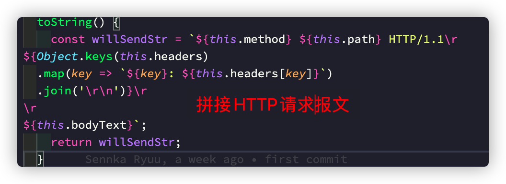
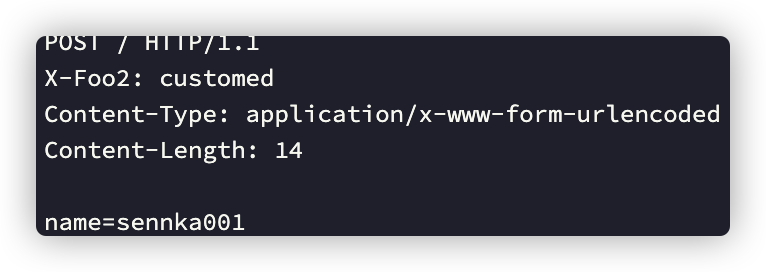
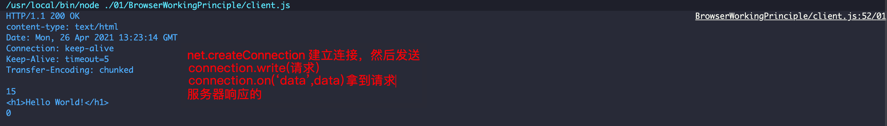
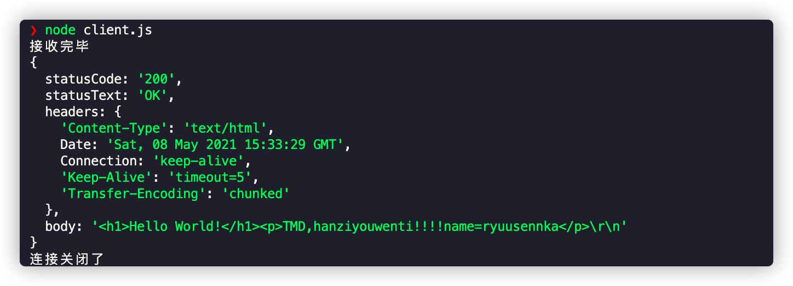

<!--
 * @Author: ryuusennka
 * @Date: 2021-04-17 16:57:44
 * @LastEditors: ryuusennka
 * @LastEditTime: 2021-05-08 23:34:07
 * @FilePath: /projects/01/BrowserWorkingPrinciple/ notes.md
 * @Description:
-->

# 浏览器工作原理

浏览器的工作原理之 http 协议的解析

## 实现一个 http 请求

- `Content-Type` 是一个必要的字段，要有默认值
- `body`是 KV 的格式
- 不同的 `Content-Type` 影响 `body` 的格式

```js
void (async function () {
  let request = new Request({
    // config object
    method: 'POST',
    host: '127.0.0.1',
    port: '8088',
    path: '/',
    headers: {
      'X-Foo2': 'customed', // 请求头信息
    },
    body: { name: 'sennka' }, // key-value
  });
  let response = await request.send(); //
  console.log(response);
})();
```





<figure>
  
  <figcaption>请求报文</figcaption>
</figure>
<figure>
  
  <figcaption>响应报文</figcaption>
</figure>


