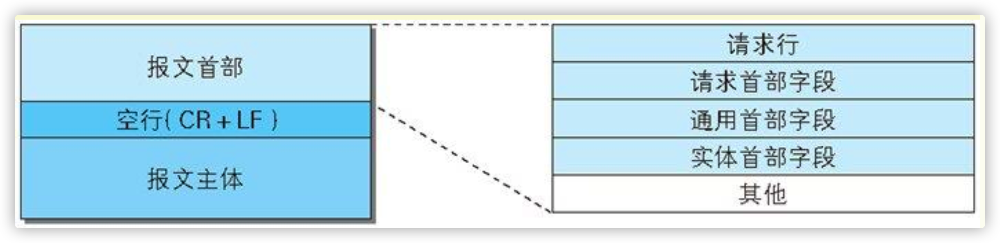
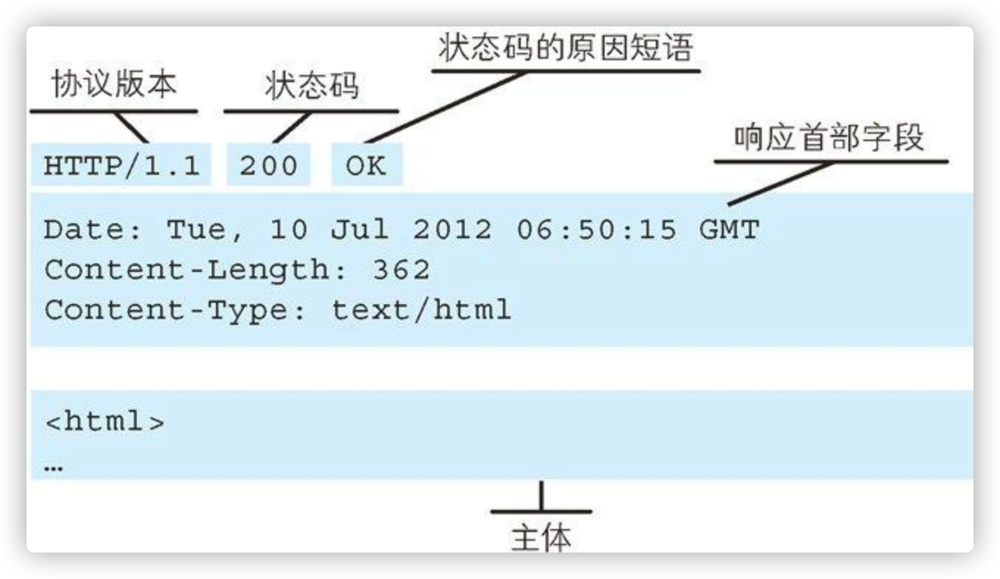

<!--
 * @Author: ryuusennka
 * @Date: 2021-05-08 23:38:01
 * @LastEditors: ryuusennka
 * @LastEditTime: 2021-05-08 23:51:54
 * @FilePath: /projects/01/BrowserWorkingPrinciple/一个http的请求和响应的过程.md
 * @Description:
-->

# 一个 http 的请求和响应的过程

1. 先要创建一个服务器，可以使用 http 模块(见[server.js](./server.js))

```js
const http = require('http');

const PORT = 8080;

http
  .createServer((request, response) => {
    let body = [];
    request
      .on('error', err => {
        console.error(err);
      })
      .on('data', chunk => {
        body.push(chunk);
      })
      .on('end', () => {
        body = Buffer.concat(body).toString();
        console.log('body: ', body);
        response.writeHead(200, { 'Content-Type': 'text/html' });
        response.end(
          `<h1>Hello World!</h1><p>TMD,hanziyouwenti!!!!${body}</p>`
        );
      });
  })
  .listen(PORT);

console.log(`Server start at port ${PORT}`);
```

2. 客户端建立连接,见 [client.js](./client.js)

使用 `net` 模块，把配置传入进去(有 **host**,**port**,还有**请求报文**)

```js
if (connection) {
  connection.write(this.toString());
} else {
  connection = net.createConnection(
    { host: this.host, port: this.port },
    () => {
      connection.write(this.toString()); // 这里是请求报文
    }
  );
}
```

<figure>
  
  <figcaption>请求报文格式1</figcaption>
</figure>
<figure>
  
  <figcaption>请求报文格式2</figcaption>
</figure>

3. 从服务器那里拿到数据，客户端自己可以来解析。
   如 **协议版本**， **状态码**， **状态原因短语** **状态行**，**响应首部字段**， **主体**等。

```js
let responseMessage = [];
connection.on('data', data => {
  responseMessage.push(data);
});
connection.on('error', err => {
  reject(err);
  connection.end();
});
connection.on('end', () => {
  console.log(`接收完毕`);
  responseMessage = Buffer.concat(responseMessage).toString();
  responseParser.receive(responseMessage);
  if (responseParser.isFinished) {
    resolve(responseParser.response);
  }
});
connection.on('close', () => {
  console.log(`连接关闭了`);
});
```


